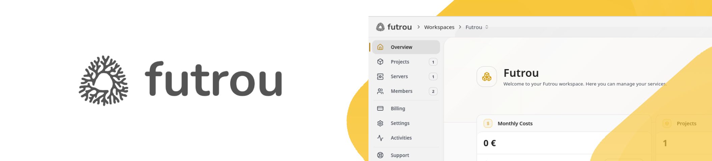

# Futrou CLI

Futrou CLI is a command-line tool for deploying and managing resources on Futrou Cloud — serverlets, proxies, DNS zones, volumes, projects and more.

## Installation

### Linux / macOS
```bash
curl -fsSL https://futrou.com/install.sh | bash
```

### Windows (PowerShell)
```powershell
irm https://futrou.com/install.ps1 | iex
```

### npm / npx (Linux, MacOS and Windows)
Requires [Node.js](https://nodejs.org/) and npm.

```bash
npm install -g futrou
# or run without installing
npx futrou --help
```

### Upgrade
```bash
futrou upgrade           # upgrade to latest
futrou upgrade 1.2.0     # upgrade/downgrade to specific version
```

## Supported platforms
- linux/amd64, linux/arm64, darwin/amd64, darwin/arm64, windows/amd64, windows/arm64, freebsd/amd64, freebsd/arm64

## Agent Skill

Install the Futrou skill for your AI coding agent (Claude Code, Cursor, Copilot, Codex, and 14+ others):

```bash
npx skills add futrou/futrou-cli
```

The skill teaches your agent how to use the Futrou CLI and REST API — deploying serverlets, managing proxies, DNS, volumes, projects, and the MCP server at `mcp.futrou.com`.

## Development

### Requirements
- **GoLang 1.25+**

### Setup
```bash
# macOS
brew install go

# Ubuntu/Debian
sudo apt install golang
```

Or install from [golang.org/dl](https://go.dev/dl/)

```bash
git clone git@github.com/futrou/futrou-cli.git
make install
```

Run the dev server (auto-rebuilds on changes):
```bash
make
```

### Build
```bash
make build        # build all platforms
make build-npm    # build npm-distributable package
make release      # build all platforms + npm
```

### Start
```bash
make start
make start login
make start serverlets list
make start ARGS="--help"
```

### Tests
```bash
make test
go test ./src/commands/... -v
```

## Release

Steps to release a new version:
1. Bump the version in `.env` using `make version bump` or set it manually with `make version set 1.2.0`
2. Create a new tag in the format `v{version}` — e.g. `v1.2.0`
3. Push the tag to GitHub: `git push origin v1.2.0`
4. The release pipeline will build binaries for all platforms and publish the release
5. Done

## License
[MIT License](LICENSE)
